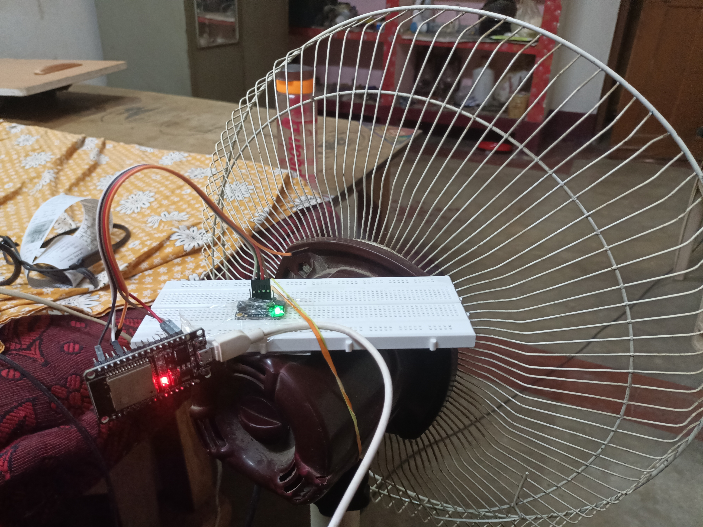

# Industry-4.0---tinyML-Anomaly-Detection
Major Project - Industry 4.0 tinyML Anomaly Detection and prevention. Using embedded systems and machine learning algorithm. Effective for machines used in manufacturing plants.
 
 
 
 
 
 
 
#Demo  
https://drive.google.com/drive/folders/1JpQxRmcGXubzX5uWTh5r1nnqbhBLL3-u?usp=sharing
 #References  
https://github.com/ShawnHymel/tinyml-example-anomaly-detection
